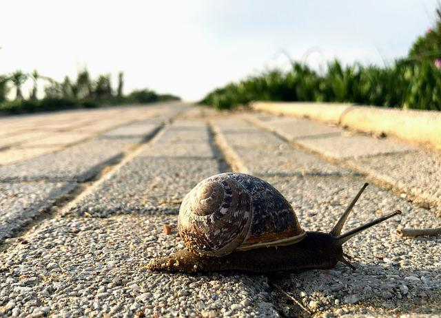

# Slow Code Kata

  
"[Slow Down Calman La Nature](https://pixabay.com/fr/photos/slow-down-calmant-la-nature-4418450/)" by [Robert Oertel](https://pixabay.com/fr/users/durststrecke-7814966/) is licenced under [Pixabay License](https://pixabay.com/fr/service/license/)

## Description

This repo is meant to be used with simple katas to practice slow (mindful) coding.

The 2 katas are:
- Fizz Buzz, instructions are available [here](https://codingdojo.org/kata/FizzBuzz/)
- Pascal Triangle, instructions are available [here](https://en.wikipedia.org/wiki/Pascal%27s_triangle)

## Getting Started

- [Java](java/GETTING_STARTED.md)
- [Javascript](javascript/GETTING_STARTED.md)
- [Go](go/GETTING_STARTED.md)
- [Python](python/GETTING_STARTED.md)
- [Typescript](typescript/GETTING_STARTED.md)

## Session Quick Retrospective

You can fill it from [here](QuickRetrospective.md)

## Useful Links

### For this Kata

- [Fizz Buzz sequence generator](https://catonmat.net/tools/generate-fizzbuzz-sequence)

### General

- [TCR (Test && Commit || Revert) wrapper](tcr/TCR.md) utility
- Handy for any type of turn-based session: [Online Timer](https://agility.jahed.dev/)

## Session Information

### Style & Duration

- 2-hour [Prepared Kata](doc/PreparedKata.md)

### Topic

- Basic TDD

### Focus Points

- Red-Green-refactor
- Baby Steps
- YAGNI

### Source Files

- [Java](java)
- [Javascript](javascript)
- [Go](go)
- [Python](python)
- [Typescript](typescript)

## License

`Kata-Slow-Code` and the accompanying materials are made available
under the terms of the [MIT License](LICENSE.md) which accompanies this
distribution, and is available at the [Open Source site](https://opensource.org/licenses/MIT)

## Acknowledgements

See [ACKNOWLEDGEMENTS.md](ACKNOWLEDGEMENTS.md) for more information.

## Contributors

<table>
<tr>
    <td align="center" style="word-wrap: break-word; width: 150.0; height: 150.0">
        <a href=https://github.com/mengdaming>
            
             
            <b>Damien Menanteau</b>
        </a>
    </td>
    <td align="center" style="word-wrap: break-word; width: 150.0; height: 150.0">
        <a href=https://github.com/philou>
            
             
            <b>Philippe Bourgau</b>
        </a>
    </td>
    <td align="center" style="word-wrap: break-word; width: 150.0; height: 150.0">
        <a href=https://github.com/aatwi>
            
             
            <b>Ahmad Atwi</b>
        </a>
    </td>
    <td align="center" style="word-wrap: break-word; width: 150.0; height: 150.0">
        <a href=https://github.com/AntoineMx>
            
             
            <b>AntoineMx</b>
        </a>
    </td>
</tr>
</table>

## Additional Contributors

### For providing initial setup for C#

<table>
<tr>
    <td align="center" style="word-wrap: break-word; width: 150.0; height: 150.0">
        <a href=https://github.com/Tr00d>
            
             
            <b>Guillaume Faas</b>
        </a>
    </td>
